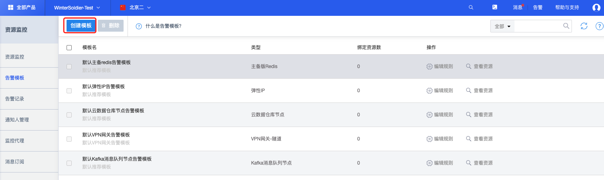
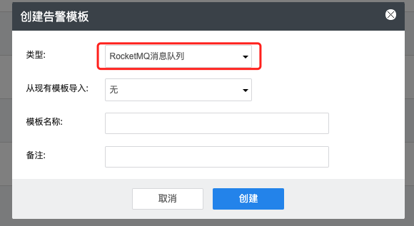
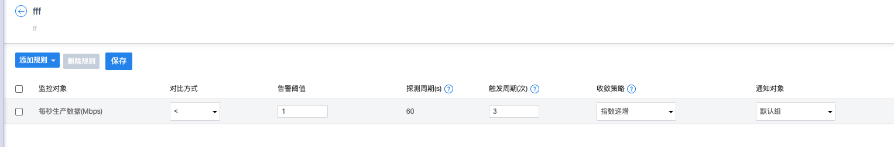

# 创建告警模板

进入 资源监控UMon - 告警模板：https://console.ucloud.cn/umon/template

点击“创建模板”按钮进入模板创建弹框。

弹框内“类型”选项选择“RocketMQ消息队列”

点击创建之后进入告警规则设置页面，可点击添加规则选择需要的指标，然后设置对应对比方式、告警阈值、触发周期、通知对象等参数完成规则创建，创建完成之后点击“保存”按钮保存规则。

